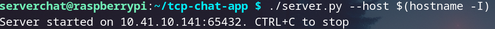
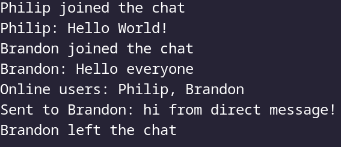
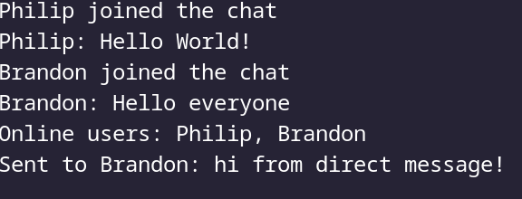
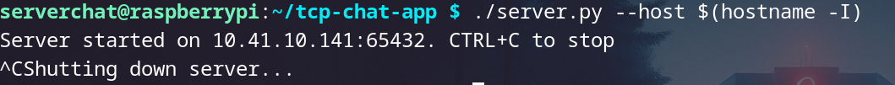

# TCP/IP Chat

## Introduction
This is a simple chat based application where users can run a server that clients then can connect to using the client Python file. The app incorporates Python socket programming to establish connections 
and send messages back and forth, using threading so that multiple clients can be handled concurrently. 

## How to start the Server
To start the server, first download the `server.py` file from the GitLab repository into a directory of your choosing and `chmod +x server.py`.\
 Then start the program by issuing the `./server.py` command with no arguments to default to host **127.0.0.1** and port **65432**. 

If you would like to use a different host or port, run `./server.py --host` followed by the **IP you wish to use**, or run `./server --port ` followed by the 
**port you wish to use** (e.g.: *34567*). 

To change both, run `./server.py --host --port`, providing the IP after `--host` and port number after `--port`. 

To shutdown the server, simply press `CTRL+C`.

## How to run the Client
To start the client, download the `client.py` file from the GitLab repository into a directory of your choosing and `chmod +x client.py`.\
 Then to start the program, issue the `./client.py` command with no arguments to default to host **127.0.0.1** and port **65432**. 

If you would like the use a different host or port, run `./client.py --host` followed by the **host IP you wish to use**, or run `./client.py --port` followed by the **port you wish to use** *ie:34567*. 

To change both, run `./client.py --host --port` providing the IP after `--host` and the port number after `--port`. 

Messaging a user is done by the `/msg` command (e.g. `/msg [user] [message]`).

Viewing active users, use the `/list` command

To exit the program, issue the `/quit` command in the chat interface.  

## Screenshots
***Server Running***\
\
***Chat Running*** \
   \
***Private Messaging***\
\
***Username Error***\
\
***Server Shutting Down***\

### Conclusion Write Up
We added many features that improve the users experience such as the `curses` library to display messages in a chat window above the input window. Other capabilities are a messaging system
that allows users to send private messages to each other, as well as a feature that allows only one unique username per user. While the socket programming came easily (once we read how to setup a connection), the biggest hurdle was checking whether a username was already taken. 
When first trying to implement it, we attempted to have the user send a name and then have the server send back a list of online users, but that proved to be ineffective. After everything was said and done, we decided that the best course of action was to create a temporary thread that listens for a response, and once the temp thread recieves a response of its validity, it breaks out of the loop and become permanent. If we had more time, some features that would be beneficial to implement include file transferring and TLS encryption.
